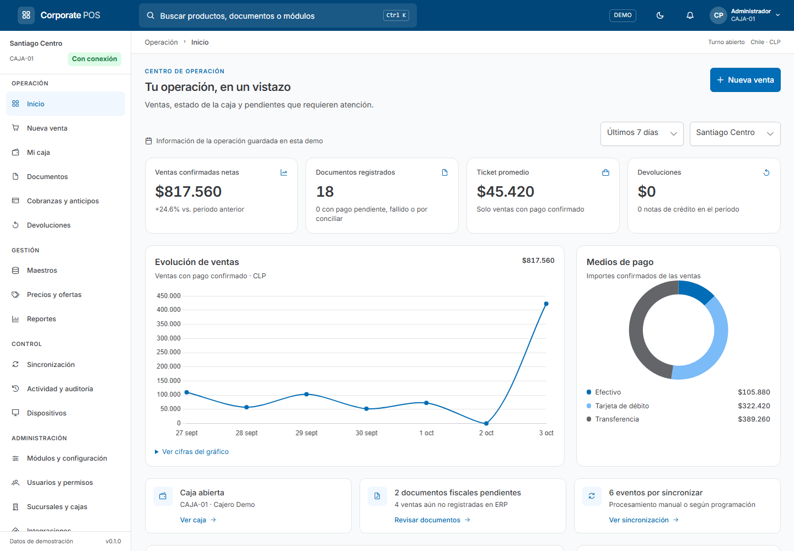

# Corporate POS

Caja corporativa para Chile: prototipo funcional de producto, con datos sintéticos y recorridos conectados. Conserva el lenguaje visual de **prime-showcase** (PrimeNG, Aura corporativo, Inter, tablas y navegación) sobre un repositorio Nx independiente. No incorpora los módulos ni dependencias de negocio del sistema anterior.



## Iniciar

Requiere Node.js 22.13+ o 24 LTS y npm 11.6.0.

```sh
npm ci
npm start
```

Abre **http://127.0.0.1:4300**. El perfil inicial es Administrador y hay una caja abierta con datos de ejemplo. El menú de usuario permite cambiar el perfil, simular desconexión y cambiar el tema. Los cambios se conservan en el navegador. Para comenzar de nuevo: **Módulos y configuración → Demostración → Restablecer**.

Todos los RUT, clientes, usuarios y operaciones son ejemplos sintéticos. No hay autenticación real, cargos bancarios, DTE válidos ni conexiones a sistemas corporativos. No ingreses información de producción.

## Recorridos

| Área              | Qué puedes probar                                                                                                                                                                              |
| ----------------- | ---------------------------------------------------------------------------------------------------------------------------------------------------------------------------------------------- |
| Inicio            | Indicadores por período y sucursal, gráficos, ranking y pendientes derivados de las operaciones                                                                                                |
| Venta             | Productos y códigos de barra, cantidades, descuentos y ofertas, cliente express, boleta/factura, despacho, pagos mixtos, vuelto y ventas pausadas; órdenes de venta con condiciones protegidas |
| Pagos             | Efectivo, débito/crédito, transferencia, cheques con Orsan, crédito cliente, NC y USD; escenario de pago incierto con conciliación sin volver a cobrar                                         |
| Mi caja           | Apertura, ingresos/egresos, custodia, conteo por denominación, arqueo, diferencias con motivo, cierre, cambio de cajero y confirmación de depósitos de custodia                                |
| Documentos        | Búsqueda y filtros, detalle, estados local/pago/fiscal/ERP separados, emisión simulada y representación imprimible                                                                             |
| Cobranzas         | Saldos y documentos pendientes, convenios en cuotas, cobro y anticipos aplicables a ventas sin cobrar de nuevo                                                                                 |
| Devoluciones      | Nota de crédito por cantidades, emisión fiscal simulada y devolución de dinero como acciones distintas                                                                                         |
| Maestros          | Productos, clientes, bancos, plazas, motivos de NC y vendedores; edición validada y exportación                                                                                                |
| Precios y ofertas | Cambio de precio, condiciones por cliente/volumen, descuentos por producto y vigencia, habilitación y auditoría                                                                                |
| Reportes          | Ventas, pagos, caja, cobranzas, devoluciones y pendientes fiscal/ERP; filtros y CSV                                                                                                            |
| Sincronización    | Flujos de subida/bajada, ejecución manual, horarios e intervalos por día, errores simulados, reintentos, cola de salida e historial                                                            |
| Control           | Logs con correlación, auditoría por actor/acción y diagnóstico descargable                                                                                                                     |
| Administración    | Módulos y políticas, usuarios/permisos, sucursales/cajas, dispositivos e integraciones, recorrido de actualización mock                                                                        |

El inventario consultivo no cambia al vender: la caja de Chile no es la autoridad de stock. Los temporizadores de sincronización funcionan mientras la aplicación está abierta; no son un servicio de Windows.

## Arquitectura

```text
apps/
  pos-web/          Angular standalone, rutas y shell
  pos-desktop/      Contenedor Tauri 2 para Windows
libs/
  domain/          Contratos, dinero CLP, permisos y calendario; TypeScript puro
  data-access/     Comandos, transacciones mock, puertos y persistencia versionada
  ui/              Preset, componentes visuales y formatos compartidos
  features/
    checkout/      Venta, caja, documentos, cobranza y devolución
    insights/      Dashboard y reportes
    administration/ Maestros, políticas, módulos y operación técnica
```

Las features consumen `PosStore`; no escriben en `localStorage`. Los permisos y módulos se validan en rutas **y comandos**. El estado se publica como snapshots inmutables. Las transacciones guardan primero el snapshot y publican el resultado solo si la persistencia tuvo éxito. Las ventas y eventos conservan identificadores para evitar duplicados. Pago, fiscalidad y ERP tienen ciclos separados.

Los límites de importación se verifican con Nx/ESLint. Se usan Angular con detección de cambios OnPush y signals, TypeScript estricto, carga diferida por área y componentes PrimeNG. La tipografía y los iconos se sirven localmente. No se utilizan `patch-package`, dependencias privadas de fuentes, telemetría ni servicios del proyecto de referencia.

## Validación

```sh
npm run lint
npm test
npm run build
npx playwright install chromium
npm run test:e2e
npm run desktop:info
```

Las pruebas cubren políticas, montos, persistencia, permisos, reintentos, calendarios y recorridos de navegador. CI está configurada para compilar y empaquetar la demostración para Windows. Las acciones de CI están fijadas por commit y tienen permisos de lectura.

## Escritorio

```sh
npm run desktop:dev
npm run desktop:build
```

Necesita Rust, MSVC/Windows SDK y WebView2. Consulta [preparación de Tauri](docs/desktop.md). El contenedor no tiene comandos para cobrar, imprimir físicamente o acceder libremente al sistema. El instalador de CI es una demostración sin firma comercial.

## De maqueta a producto

Esta entrega permite validar la UX y las reglas mock; **no es una caja certificada ni lista para operar en producción**. El adaptador local del navegador no sustituye una base transaccional de escritorio, autenticación corporativa, permisos verificados por servidor, conciliación bancaria ni homologación fiscal. Esas fronteras y el diseño para evolucionarlas se describen en [arquitectura](docs/architecture.md), [seguridad](docs/security.md) y [contratos mock](docs/mock-api.md).

La cobertura de Chile y las referencias revisadas están en [inventario de la caja actual](docs/audit-chile-for-product.md). Ese inventario distingue la funcionalidad de referencia, la simulación y lo que necesita integración real.
